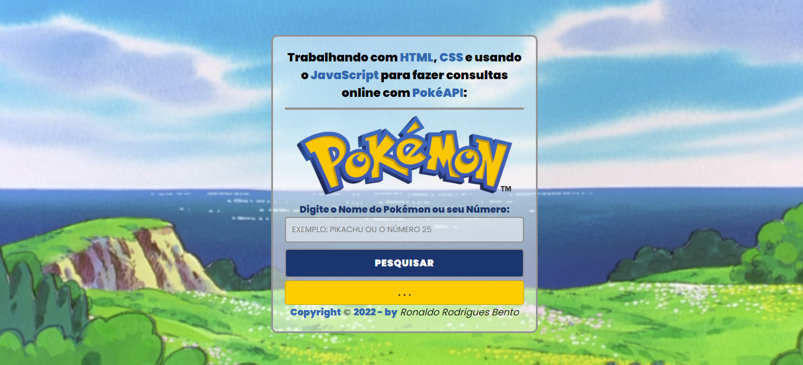
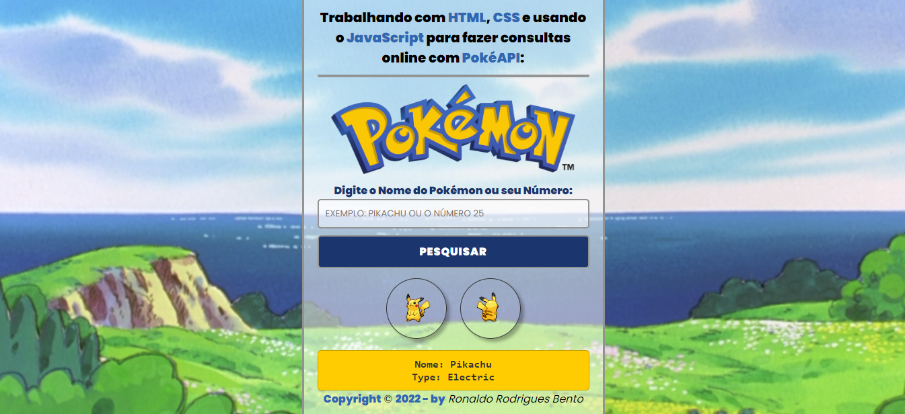

# pokemon-main

  

## PokéAPI - Uma API externa para fazer pesquisas de forma dinâmica. 

 <a href="https://pokeapi.co/" target="_blank" rel="external" title="pokeapi"><strong>Documentação da API: PokéAPI</strong></a> 

## Screenshot do projeto:

 

  

## API externa para fazer pesquisas de forma dinâmica. PokéAPI:

 ## IMPORTANTE ##
 
   
  
 
Você tem todo o direito de usar esse material para seu próprio aprendizado. Espero que seja útil o conteúdo disponibilizado.
 
 
 <h2>:bookmark_tabs: Descrição</h2>
 
 
<strong>HTML</strong> é um acrônimo para Hyper Text Markup Language que é uma linguagem de estruturação e apresentação de conteúdo para a World Wide Web. O conhecimento desta linguagem, juntamente com as tecnologias CSS3 e JavaScript é essencial para todos os profissionais de web. <strong>CSS3</strong> é a terceira versão da linguagem de marcação CSS, ou Cascading Style Sheets. 

Ela define formatos e padrões estéticos dentro de uma página da web em um arquivo de códigos separado do HTML e/ou do JavaScript, chamados folha de estilo, facilitando a implementação destas modificações e trazendo mais facilidade ao trabalho do profissional desenvolvedor.

 
 
<strong>JavaScript</strong> é uma linguagem de programação de alto nível criada, a princípio, para ser executada em navegadores e manipular comportamentos de páginas web.
 Segundo a <em>Mozilla Foundation</em>, atual nome da antiga Netscape Communications Corporations, empresa responsável pela criação do JS, "JavaScript é uma linguagem de programação, leve, interpretada, orientada a objetos, baseada em protótipos e em first-class functions (funções de primeira classe), mais conhecida como a linguagem de script da Internet."

Com seus scripts é possível incluir, em uma página estática, elementos dinâmicos como mapas, formulários, operações numéricas, animações, infográficos interativos e muito mais.

O <strong>GitHub Pages</strong> é um serviço de hospedagem de site estático que usa arquivos HTML, CSS e JavaScript diretamente de um repositório no GitHub e, como opção, executa os arquivos por meio de um processo e publica um site.

<a href="https://ronaldobento.github.io/pokemon-main/index.html" target="_blank" rel="external" title="Clique aqui para entrar no site do projeto pokemon-main"><strong>Clique aqui para entrar no site do projeto pokemon-main ou utilize o QR Code abaixo</strong></a> 

 

